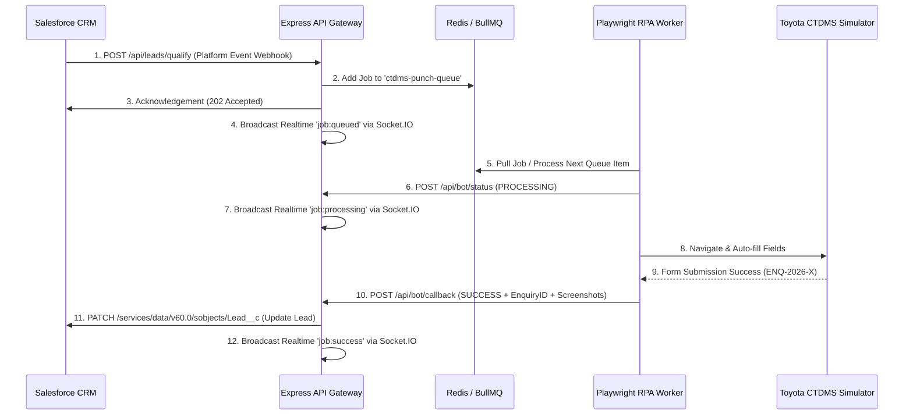

# Galaxy Toyota — CTDMS Auto-Punch RPA System
## Integration Flow & REST API Specifications

This document defines the integration flow, data contracts, and WebSocket event channels used to coordinate the Salesforce CRM and Toyota DMS integration.

---

## 📅 API Sequence Diagram



---

## 🔗 Core Endpoint Specifications

### 1. Salesforce Event Webhook
* **Endpoint**: `POST /api/leads/qualify`
* **Description**: Receives the qualified lead change event from Salesforce.
* **Payload**:
```json
{
  "leadId": "SF-LEAD-00894",
  "name": "Vikram Malhotra",
  "mobile": "+91 95600 78912",
  "altMobile": "+91 98111 22233",
  "city": "Gurugram",
  "showroomCode": "GUR-02",
  "modelInterest": "Toyota Camry Hybrid",
  "leadSource": "Facebook Portal",
  "financeRequired": true,
  "exchangeRequired": true,
  "testDriveRequired": true,
  "budget": "₹46,00,000"
}
```
* **Response (202 Accepted)**:
```json
{
  "status": "QUEUED",
  "message": "Lead event received and pushed to orchestrator queue.",
  "jobId": "job_1779180630"
}
```

### 2. Bot Callback Webhook
* **Endpoint**: `POST /api/bot/callback`
* **Description**: The standalone RPA worker calls this API to return enquiry submission details or failure screenshots back to the orchestrator database.
* **Payload**:
```json
{
  "leadId": "SF-LEAD-00894",
  "status": "SUCCESS",
  "enquiryId": "ENQ-2026-78090",
  "beforeSubmitScreenshot": "/screenshots/SF-LEAD-00894_before.png",
  "confirmScreenshot": "/screenshots/SF-LEAD-00894_confirm.png",
  "durationMs": 46200,
  "logs": [
    "Pulled job SF-LEAD-00894 from queue",
    "Validation passed",
    "Headless Chrome launched",
    "Logged in successfully",
    "Typed Vikram Malhotra into CustomerName",
    "Completed form inputs",
    "Clicked Submit",
    "Submission successful: Enquiry ENQ-2026-78090 captured"
  ]
}
```
* **Response (200 OK)**:
```json
{
  "status": "UPDATED",
  "message": "Salesforce lead records patched successfully."
}
```