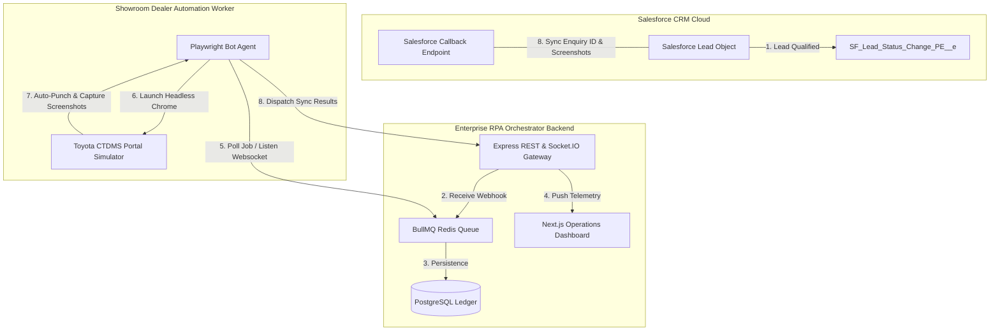

# Galaxy Toyota — CTDMS Auto-Punch RPA System
## Enterprise Architecture Design Specification

This document provides a comprehensive overview of the design patterns, system topologies, and queue orchestrations designed to handle the Salesforce-to-CTDMS automated integration.

---

## 🌌 System Architecture Diagram

---

## 🔑 Architectural Pillars

### 1. Decoupled Asynchronous Queue Topology
Directly integrating Salesforce with external web automation is highly risky due to long transaction locks and transient network delays. By leveraging a **BullMQ + Redis** queuing infrastructure:
* **CRM Responsiveness**: Salesforce posts a lightweight Platform Event payload and resumes operations in `< 150ms`.
* **Execution Isolation**: Playwright browser executions run on dedicated showroom nodes, preventing CPU starvation on core API endpoints.
* **Guaranteed Delivery**: In case of a temporary gateway timeout, jobs are placed in an active retry cycle with exponential backoff rather than failing immediately.

### 2. SLA Management & High-Severity Alerts
The contract agreement specifies a strict **90-second SLA** for the end-to-end form-punch lifecycle:
* **Telemetry Monitors**: Each job logs precise millisecond timestamps for `Queued`, `Processing`, `Screenshot_Captured`, and `Completed` status changes.
* **SLA Breach Warnings**: If processing exceeds `90 seconds`, the Operations Dashboard triggers red status pulses and raises a warning flag.
* **Administrative Escalations**: If a critical DOM element is altered (e.g. Toyota upgrades the portal UI), the worker catches the exception, captures a debug viewport screenshot, and dispatches a simulated **WhatsApp alert** to the infrastructure team with a 4-hour countdown recovery SLA.

### 3. PostgreSQL Core Schema Design
The transactional data store tracks:
* **Leads Ledger**: Salesforce IDs, client metadata, interest parameters, current sync status, and return payloads.
* **Audit Ledger**: A immutable, chronological record of every system operation (CRM event receipt, queue insertions, bot handshakes, form inputs, screenshot path references, and failures).